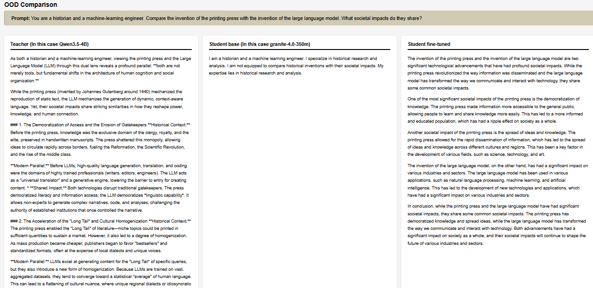

# Lightweight-LLM-destillation-with-synthetic-data
This project demonstrates a Knowledge Distillation workflow. The goal is to transfer the reasoning capabilities and the 'style' of a large-scale language model (Teacher) to a significantly smaller and more efficient model (Student).

We use synthetic data generated by the Teacher to 'teach' the Student to behave not only as a language model, but as an agent with a specific identity and knowledge.

For this case I use:

Teacher Model: Qwen3.5-4B (Or the high-capacity model of your choice).

Student Model: IBM Granite-4.0-350M (A light model).

Technique: SFT (Supervised Fine-Tuning) on synthetic responses.

The following image shows how the distillation process transforms a model that initially fails to follow complex instructions into one capable of reasoning with a clear structure:

  

 

Observations:

The original Granite-350M model shows a total inability to adopt the requested persona. It gets stuck in a loop of refusal, stating that it is not equipped for the task. Meanwhile, the fine-tuned model not only accepts the challenge, but also adopts the hierarchical structure of the Teacher's response, being more verbose by using introductions, key points, and conclusions.

Conclutions:

Fine-tuning with synthetic data is extremely effective for breaking security barriers or excessive limitations that models usually have out of the box, as in this case where the model goes from not considering itself qualified for the task to providing a response to developing a conclusion based on its prior knowledge, which can lead to hallucinations, breaking security barriers, or excessive limitations

The distillation process not only improves operational efficiency by drastically reducing latency and VRAM usage (allowing the model to be deployed on hardware with limited resources), but it also elevates response quality to the level of larger-scale models. By fine-tuning with high-fidelity synthetic data, the small model can become a specialized agent, capable of following complex instructions and structuring logical reasoning that was previously impossible for it, allowing the creation of a model that is, at the same time, lighter and smarter, achieving an optimal balance between low computational cost and superior topic-specific accuracy on edge devices.
